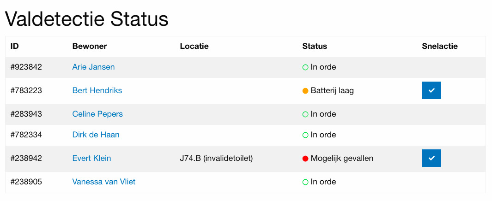

# Valiets Webinterface




## Prerequisites

- NPM


## Installation

```sh
# Clone the repository
git clone https://github.com/ValIets/webinterface.git

# Go to directory
cd valiets-webinterface

# Install npm dependencies
npm install
```


## To-do's

- Use Font Awesome 5 as npm dependency.
